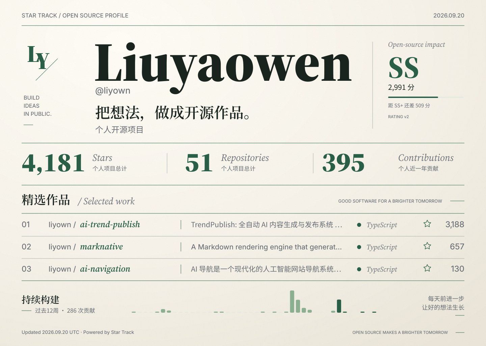

# Star Track

把开源作品、真实积累与持续投入，排成一张属于你的 GitHub 名片。

Star Track 是一个 GitHub
Action：收集个人与组织的公开仓库数据，生成完整的 SVG 卡片，并更新 README。支持精选项目、D− 到 SSS 等级、深浅主题和手机布局。图片、字体与数据都随仓库保存，无需部署图片服务器。

<!-- BEGIN_GITHUB_STATS -->

<!-- prettier-ignore-start -->

<picture>
  <source media="(prefers-color-scheme: dark) and (max-width: 640px)" srcset="assets/star-track/profile-dark-compact.svg" />
  <source media="(max-width: 640px)" srcset="assets/star-track/profile-light-compact.svg" />
  <source media="(prefers-color-scheme: dark)" srcset="assets/star-track/profile-dark.svg" />
  
</picture>

[liyown/ai-trend-publish](https://github.com/liyown/ai-trend-publish) · [liyown/marknative](https://github.com/liyown/marknative) · [liyown/ai-navigation](https://github.com/liyown/ai-navigation)

<details>
<summary>查看统计与评分明细</summary>

[完整统计报告](assets/star-track/summary.md) · [JSON](assets/star-track/stats.json)

</details>

<!-- prettier-ignore-end -->

<!-- END_GITHUB_STATS -->

## 一键 Agent 接入

点击下面代码块右上角的
**复制按钮**，将整段提示词发送给能访问 GitHub 和操作仓库的 Agent。Agent 会完成配置、README 更新和定时工作流接入；需要已登录 GitHub，且有目标仓库的写入权限。

```text
请帮我把 Star Track 开源名片接入我的 GitHub 个人主页，并完成首次运行验证。

项目：https://github.com/liyown/star-track-action
先读取接入文档：https://raw.githubusercontent.com/liyown/star-track-action/main/docs/agent-setup.md
再核对该仓库当前的 README、action.yml 和 star-track.yml，按真实接口实施。

请用 GitHub 登录信息和仓库 remote 确认我的账号及个人主页仓库（用户名/用户名）；无法确定时再问我。不要把示例作者的信息复制成我的资料。
默认使用深浅色自动切换、中文文案、保留等级、个人及公开组织项目统计，精选项目自动取 Star 最多的三个非 Fork 公开仓库。组织整体数据要明确标注归属，不猜测私有组织关系。
保留 README 的现有内容，仅更新 Star Track 统计标记区域；已有旧版统计工作流时直接迁移，避免两套工作流相互覆盖。
将上游 main 解析为真实的完整 commit SHA，并固定到工作流中；使用 secrets.GITHUB_TOKEN，配置 contents: write、每日定时和手动触发，不要求我粘贴 Token。
完成配置和检查后，提交并推送本次接入文件，触发工作流并确认运行成功。遇到分支保护则创建 PR；需要额外权限时明确说明，不绕过限制。
最后给我主页链接、工作流运行链接，并说明如何改名字、介绍、组织和精选项目。只有确认 SVG 文件已生成且 README 图片能显示后，才报告接入完成。
```

详细步骤与验收标准见
[Agent 接入指南](docs/agent-setup.md)。如果希望手动配置，继续阅读下方快速开始。

## 快速开始

在你的个人主页仓库（`用户名/用户名`）中创建 `.github/workflows/star-track.yml`：

```yaml
name: Update my open-source profile
on:
  schedule:
    - cron: '0 1 * * *'
  workflow_dispatch:

permissions:
  contents: write

concurrency:
  group: star-track
  cancel-in-progress: false

jobs:
  profile:
    runs-on: ubuntu-latest
    steps:
      - uses: actions/checkout@v6
      # main 始终指向当前实现；需要固定版本时替换为完整 commit SHA。
      - uses: liyown/star-track-action@main
        with:
          github_token: ${{ secrets.GITHUB_TOKEN }}
          username: ${{ github.repository_owner }}
          scope: all
```

Agent 接入会解析并固定上游完整 commit
SHA，便于复现和控制升级。开发本仓库时，示例工作流通过 `uses: ./`
使用检出的打包产物。

默认选择 Star 最多的三个非 Fork 公开仓库；需要定制时，在使用者仓库根目录放置
`star-track.yml`：

```yaml
username: your-name
scope: all

profile:
  name: Your Name
  initials: YN
  headline: 把想法，做成开源作品。

# 省略时发现公开的组织成员关系；私有成员关系请显式列出。
# 设置 [] 则不添加任何组织。
organizations:
  - your-organization

featured:
  - repo: your-name/project-one
    description: 用一句话介绍你最想让别人认识的作品
  - your-organization/project-two
  - your-name/project-three

repositories:
  include_forks: false
  include_archived: true
  exclude: []

appearance:
  theme: auto # auto | light | dark
  locale: zh-CN # zh-CN | en（自定义介绍不会自动翻译）
  title: OPEN SOURCE PROFILE

rating:
  enabled: true

output:
  directory: assets/star-track
  readme: README.md
```

精选项目最多六个，按配置顺序展示。项目必须在所选公开仓库范围内，且未被过滤；不存在、无访问权限或写错名字都会明确失败，不会悄悄换成另一个项目。
`featured: []` 或省略配置时，自动选择前三个。

`scope: personal` 只统计个人名下仓库；`scope: all`
加入组织的整个公开仓库集合。组织整体成果并不等同于个人贡献，卡片会分别标注。

## 输出与展示

每次运行生成：

| 文件                                                     | 用途                                            |
| -------------------------------------------------------- | ----------------------------------------------- |
| `profile-light.svg` / `profile-dark.svg`                 | 完整桌面卡片                                    |
| `profile-light-compact.svg` / `profile-dark-compact.svg` | 窄屏专用排版                                    |
| `stats.json`                                             | 本次完整统计、范围、贡献时间窗与评分明细        |
| `history.json`                                           | 按 UTC 日期保存的日快照，同一天覆盖；保留约一年 |
| `summary.md`                                             | 可阅读、可复制、带仓库链接的文字报告            |

README 自动嵌入 `<picture>`，按 `prefers-color-scheme` 和 `max-width: 640px`
选择主题和布局。不支持 `<picture>`
的阅读器会显示默认桌面图。SVG 内的文字转换为矢量轮廓，不依赖浏览者安装字体或访问字体 CDN。头像与外部图片不会被加载；左侧标识使用可配置的姓名缩写。

完整图片中的项目行不可单独点击，因此卡片下方会输出仓库链接，同时提供
`alt`、SVG 标题/说明和可展开的文字报告。中文、拉丁文及常见 CJK 字符由随包字体支持；Emoji 和未覆盖文字不属于当前字体支持范围。

只替换 README 中 `BEGIN_GITHUB_STATS` 与 `END_GITHUB_STATS`
注释之间的内容；没有标记时添加到文件末尾。标记缺失一半、顺序错误或有多组时会停止更新，保护其他内容。

## 统计口径

| 指标                                                 | 口径                                                                             |
| ---------------------------------------------------- | -------------------------------------------------------------------------------- |
| Stars / Repositories / Forks                         | 选中范围内的公开仓库；默认排除 Fork 仓库                                         |
| Watchers                                             | GraphQL `watchers.totalCount`，即订阅者，区别于 REST 的 `watchers_count`（Star） |
| Issues / PRs、关闭率 / 合并率                        | 选中仓库内所有作者，不是个人创建数                                               |
| Contributions / Commits / Issues opened / PRs opened | 用户近 365 天，按 GitHub contributionsCollection 规则                            |
| 活动图                                               | 最近 84 个 UTC 日期，每两天一柱，零值不会伪造为活跃                              |
| Top language                                         | 仓库主语言出现次数，不是代码字节数                                               |
| days_active                                          | 账号创建至今的天数，不是实际活跃天数                                             |
| contributed_to_count                                 | GitHub `repositoriesContributedTo` 公开仓库计数，含个人仓库；不声称是终身累计    |

贡献汇总受 Token 可见范围及 GitHub 贡献规则影响，可能包含私有贡献的汇总数量；本工具不请求或输出私有仓库名称。不要把贡献次数理解为所有分支上的 Git
commit 总数。

组织自动发现使用公开成员关系。组织成员关系隐藏时，在 YAML 的 `organizations`
中显式列出。这也让组织改名、加入或退出不会悄悄改变你希望展示的范围。

历史从第一次运行开始记录，不会编造历史增长。采集范围改变时重置历史序列。当前卡片底部展示可直接从 GitHub 获取的个人贡献活动，日快照供后续比较或外部分析使用。

## 评分与等级

保留 D−、D、D+、C−、C、C+、B−、B、B+、A−、A、A+、S−、S、S+、SS、SS+、SSS 等级体系，最高档阈值为 5000 分。卡片显示当前等级、分数以及距下一等级的差值。等级是
**开源影响力分数**，不是个人技术能力排名。

v2 公式：

| 项目                       | 分值                                                                               |
| -------------------------- | ---------------------------------------------------------------------------------- |
| 公开仓库                   | 每个 1 分                                                                          |
| Stars                      | 每个 0.5 分                                                                        |
| 近一年个人 Commit 贡献     | 每次 0.1 分，上限 300                                                              |
| 近一年个人 Issue / PR 贡献 | 每次 0.05 / 0.1 分，各上限 50                                                      |
| Followers                  | 每个 0.3 分                                                                        |
| GitHub 贡献仓库计数        | 每个 2 分                                                                          |
| 获得的 Fork                | 每个 0.2 分                                                                        |
| Star 里程碑奖励            | 100 / 500 / 1000 / 5000 / 10000 星，对应 50 / 200 / 500 / 1000 / 2000 分，取最高档 |
| 平均仓库 Stars             | 平均值 × 2，上限 100                                                               |
| 账号年限                   | 每年 5 分，上限 25                                                                 |

最终总分统一四舍五入。各项得分写入 `stats.json` 和 `summary.md`；完整阈值见
[src/rating.ts](src/rating.ts)。关闭率、合并率不再混入个人贡献加分。

## 安全更新与权限

- 任意仓库分页或个人统计请求失败，整次采集失败，已有图片和统计文件保持不变。卡片原有的更新时间仍可见；工作流会明确失败。
- 对临时 5xx、429 和带短期 Retry-After 的 403 做有限重试，其他权限错误直接失败。
- 所有内容生成及 README 验证完成后才写文件；普通写入错误会回滚已替换文件。不承诺操作系统崩溃时跨多个文件的事务原子性。
- `auto_commit: true`
  默认开启，兼容旧行为。只添加生成的具体文件；检测到既有暂存改动会拒绝提交。分离 HEAD、提交失败、推送失败都会让 Action 失败，不再打印虚假成功。
- `auto_commit: false` 只写文件和设置输出，适合自行创建 PR 或在后续步骤提交。
- API Token 与推送凭据分别使用：`github_token` 读取 API，`actions/checkout`
  的凭据负责推送。普通公开数据可先使用
  `GITHUB_TOKEN`；访问受到限制时根据实际需要配置 Token。
- 输出路径限定在工作区内，不接受穿越路径、`.git`
  路径或符号链接。Git 使用参数数组，不拼接 shell。

## Action 参数

| 参数           | 默认与行为                                              |
| -------------- | ------------------------------------------------------- |
| `github_token` | 必填                                                    |
| `config_path`  | 省略时自动寻找 `star-track.yml`；显式指定却不存在会报错 |
| `username`     | 覆盖 YAML 的 username；两处至少提供一处                 |
| `scope`        | 覆盖 YAML；无配置时为 personal                          |
| `readme_path`  | 覆盖 YAML 的 output.readme；默认 README.md              |
| `card_title`   | 覆盖 YAML 的 appearance.title                           |
| `auto_commit`  | true；必须为 true 或 false                              |

保留旧统计输出，并新增 `contributions_count`、`watchers_count`、`card_path`、
`stats_path` 和 `changed`。完整清单见 [action.yml](action.yml)。

**迁移提醒：** v2 的 `commits_count` 改为近一年个人贡献，默认排除 Fork，
`days_active`
改为账号年龄，评分公式也有版本变化。因此旧分数与新分数不能直接视为涨跌。Action 运行时升级为 Node
24，自托管 Runner 需要支持 Node 24 JavaScript Actions。

## 本地开发

使用 Node 24 与 npm（仓库提交 package-lock.json）：

```sh
npm ci
npm run all
npm run preview
```

`npm run preview` 使用固定示例数据和日期，生成四种 SVG、PNG 以及
`preview/index.html`。此命令不需要 Token，不提交、不推送。用本地 HTTP 服务打开预览：

```sh
python3 -m http.server 4173 --bind 127.0.0.1 --directory preview
```

读取真实数据、仅更新本地文件：

```sh
# 使用当前 GitHub CLI 登录
npm run collect -- --gh
# 或通过环境变量 GITHUB_TOKEN 提供凭据
npm run collect
# 查看已经采集的数据
npm run preview -- --live
```

`npm run collect` 不会创建 commit 或 push。工作流与本地命令共用采集和渲染代码。

源码按配置校验、GitHub 采集、评分、SVG 渲染、输出和 Git 提交拆分。测试覆盖分页失败、统计口径、等级边界、配置与路径安全、README 保留、历史记录、无系统字体渲染、提交隔离和推送失败。CI 检查类型、Lint、测试和打包产物一致性。

## 字体与许可证

代码采用 [MIT](LICENSE)。随包的 Source Serif 4 Display / Subhead、Inter、Noto
Serif CJK SC 和 Noto Sans CJK SC 采用 SIL Open Font
License；许可证、固定的下载来源与 SHA-256 见
[assets/fonts](assets/fonts)。星标图标来自 MIT 许可的 GitHub Octicons，许可证见
[assets/icons](assets/icons)。
